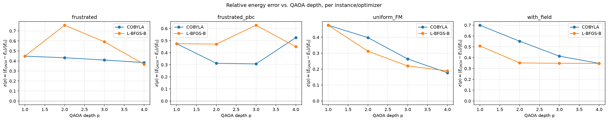

# QAOA for Ising Models

QAOA ground-state energy search for a 1D Ising model validated against exact
diagonalization. Optimizer choice (COBYLA / L-BFGS-B) and device (CPU / GPU)
are both runtime-selectable, and results are benchmarked with a depth sweep 
across several coupling regimes.

## The model

```
H = Σ_i J_i * Z_i * Z_(i+1)   +   Σ_i h_i * Z_i
```

- `J_i`: nearest-neighbor coupling between site `i` and `i+1` -- random,
  uniform, ferromagnetic (`J < 0`) or antiferromagnetic (`J > 0`)
- `h_i`: optional local longitudinal field at site `i` (zero recovers a
  pure-coupling model)
- **OBC** (open boundary): chain, no wraparound term
- **PBC** (periodic boundary): adds a wraparound bond `J_N * Z_N * Z_1`,
  forming a ring

`H` is diagonal in the computational basis, so the QAOA cost unitary is
built from `RZZ` gates (one per coupling) and `RZ` gates (one per field
term), with an `RX` mixer.

## Module breakdown (`src/`)

| Module | Responsibility                                                                                                                                                                                  |
|---|-------------------------------------------------------------------------------------------------------------------------------------------------------------------------------------------------|
| `ising_model.py` | Generates 1D Ising instances: random/uniform couplings, optional fields, OBC/PBC, reproducible via seeds.                                                                                       |
| `hamiltonian.py` | Converts `(J, h, boundary)` into a `SparsePauliOp` cost Hamiltonian, and provides an independent classical bitstring-energy function for cross-checking.                                        |
| `qaoa_circuit.py` | Builds the parameterized depth-`p` QAOA ansatz (`RZZ`/`RZ` cost layer + `RX` mixer) via `QAOAAnsatz`.                                                                                           |
| `optimizer.py` | Runs the QAOA optimization loop with a selectable optimizer (COBYLA or L-BFGS-B) and device: `"CPU"` (qiskit's `StatevectorEstimator`), `"GPU"` (Aer/CUDA), or `"CPU_AER"` (Aer's CPU backend). |
| `exact_solver.py` | Independent exact diagonalization of the full Ising Hamiltonian (`numpy.linalg.eigh`) for small chains, used as the baseline QAOA results are compared against.                                 |
| `experiment.py` | (a) Runs the depth sweep: for each instance, `p`, and optimizer, runs multiple restarts and records the best energy, relative error `ε(p) = (E_qaoa(p) - E_0)/                                      |E_0|`, and run metadata into `SweepRecord`s ready for plotting or `json.dump`. (b) Runs the warm-start comparison: standard QAOA vs. Egger-WS head-to-head, writing a CSV of energy/`P_gs`/circuit-cost per `(n, p, method)` — see [Warm-starting: Egger-WS](#warm-starting-egger-ws) below. |
| `warm_start/` | Warm-Start QAOA (Egger-WS) — see the [Warm-starting: Egger-WS](#warm-starting-egger-ws) section below. |

## Running it

There are two notebooks with distinct roles:

- **`notebooks/run_on_colab.ipynb`** — driver that installs
  dependencies, imports directly from `src/`, runs a depth sweep via
  `run_depth_sweep`, and saves results to `results/depth_sweep_results.json`.
  A `COLAB_DEVICE` flag near the top of the setup cell selects `"CPU"` or
  `"GPU"` for the whole session.
- **`notebooks/analysis.ipynb`** — loads `results/depth_sweep_results.json`
  (and `results/gpu_timing_results.json` if present) and produces the
  `ε(p)` vs. `p` plots (saved to `results/epsilon_vs_p.png`, embedded
  below), the uniform-vs-frustrated comparison, restart-energy spread and
  cost plots, and a CPU-vs-GPU wall-clock chart. It
  does not recompute anything and does not require Colab, so it can be run
  entirely offline against previously saved results.

### Local setup

```bash
pip install -r requirements.txt
jupyter notebook
```

Then run `notebooks/run_on_colab.ipynb` (locally or on Colab) to generate
results, followed by `notebooks/analysis.ipynb` to plot them.

## Current results (confirmation run)




## Warm-starting: Egger-WS

`src/warm_start/` implements **Warm-Start QAOA (Egger-WS)** [1], written
directly from its paper. It sits on top of `ising_model.py` /
`hamiltonian.py` / `qaoa_circuit.py` / `optimizer.py` and behind
`optimizer.py`'s `initial_params`/`estimator` extension points and
`experiment.py`'s `warm_start_fn` extension point.

`experiment.py` also runs a head-to-head comparison via `src/warm_start/egger_ws.py`'s
uniform `WarmStartComparisonResult` interface, recording energy, ground-state
success probability `P_gs`, and circuit-evaluation cost/wall time for each
`(n, p, method)` to CSV. Cost is reported alongside energy deliberately:
Egger's warm-start is a one-shot classical preprocessing pass costing zero
circuit evaluations, so the comparison is only meaningful if the cost is compared
alongside accuracy.

Modules:

- `src/warm_start/ws_ansatz.py` -- the WS-QAOA initial state and mixer
  (Eqs. A5-A8 of [1]), the bitstring-derived bias generalization, and the
  ansatz builder (on top of `qaoa_circuit.build_qaoa_circuit`'s
  `mixer_operator`/`initial_state` parameters).
- `src/warm_start/egger_ws.py` -- Warm-Start QAOA [1], continuous and
  rounded variants (`run_egger_ws`), its mean-field-relaxation classical
  front end (this project's chosen analogue of Egger et al.'s continuous
  relaxation for a 1D chain, which has no natural convex relaxation the way
  Max-Cut does), and the uniform `WarmStartComparisonResult` interface
  (`run_standard_qaoa`/`run_egger_ws`) that `experiment.py`'s comparison
  sweep calls.
- `src/warm_start/noise.py` -- an amplitude-damping noise model plus
  `optimize_qaoa_noisy`, a thin wrapper around `optimizer.py`'s `estimator`
  injection parameter, for running QAOA under simulated dissipative noise.

**What is true to the sources:** the WS initial state and mixer, with the exact
single-qubit mixer rotation rather than a Trotter approximation, 
and the mixer/initial-state alignment that gives
WS-QAOA its performance guarantee [3].

**What is adapted:**
- Instances are this project's 1D-chain `IsingInstance`s, not the paper's
  Max-Cut graphs.
- Variational angles are optimized with
  COBYLA/L-BFGS-B (`optimizer.optimize_qaoa`).
- Noise is simulated (`qiskit_aer` amplitude damping via `noise.py`), not
  measured on a QPU.


## Acknowledgements and references

1. Egger, Marecek, Woerner, "Warm-starting quantum optimization," Quantum
   5, 479 (2021), arXiv:2009.10095. — the warm-start method
2. Farhi, Goldstone, Gutmann, "A Quantum Approximate Optimization
   Algorithm," arXiv:1411.4028 (2014). — QAOA
3. He, Shaydulin, Chakrabarti, Herman, Li, Sun, Pistoia, "Alignment
   between initial state and mixer improves QAOA performance for
   constrained optimization," npj Quantum Information 9, 121 (2023). —
   why the mixer must have `|c>` as ground state
4. Cain, Farhi, Gutmann, Ranard, Tang, "The QAOA gets stuck starting from
   a good classical string," arXiv:2207.05089 (2022). — why `c > 0`
5. Tate, Eidenbenz, "Warm-Started QAOA with Aligned Mixers Converges
   Slowly Near the Poles of the Bloch Sphere," arXiv:2410.00027 (2024). —
   why `c` must not go to 0
6. Tools: Qiskit, Qiskit Aer, SciPy, NumPy.

This implementation is an independent reimplementation written directly
from [1]. See `src/warm_start/`'s docstrings for the specific
equations each module implements.
